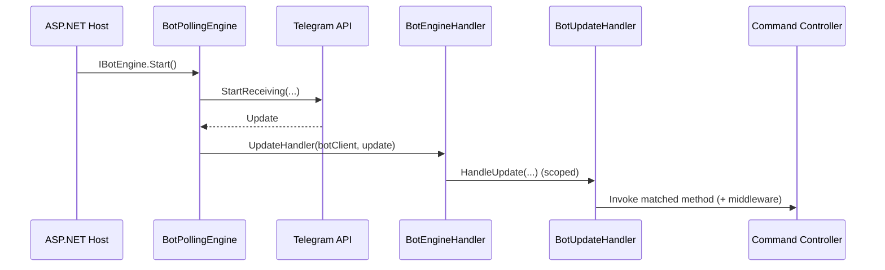
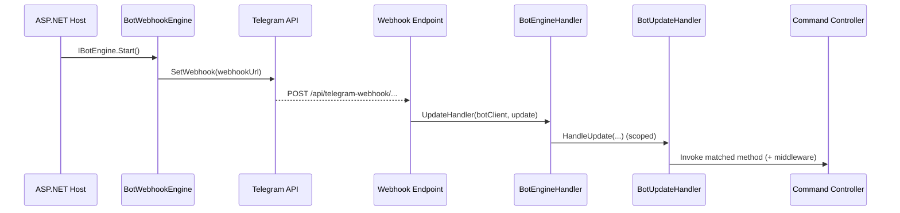

# Architecture Overview

## What This Repo Is

ZiziBot.TelegramBot is a command-based Telegram bot framework packaged as a .NET library, plus a sample ASP.NET Core host that demonstrates how to run it.

- Framework library: [ZiziBot.TelegramBot.Framework.csproj](../../ZiziBot.TelegramBot.Framework/ZiziBot.TelegramBot.Framework.csproj)
- Sample host: [ZiziBot.TelegramBot.Sample.csproj](../../ZiziBot.TelegramBot.Sample/ZiziBot.TelegramBot.Sample.csproj)
- Top-level repository description: [README.md](../../README.md#L6-L62)

## High-Level Components

The framework is organized around these core responsibilities:

- **Hosting integration**: registers services, discovers command controllers, selects engine mode (polling vs webhook). See [ClientExtension](../../ZiziBot.TelegramBot.Framework/Extensions/ClientExtension.cs#L17-L165).
- **Engines**: bring Telegram updates into the app.
  - Polling: [BotPollingEngine](../../ZiziBot.TelegramBot.Framework/Engines/BotPollingEngine.cs#L11-L104)
  - Webhook: [BotWebhookEngine](../../ZiziBot.TelegramBot.Framework/Engines/BotWebhookEngine.cs#L11-L103)
- **HTTP endpoints (webhook mode)**: maps `/api/telegram-webhook/...` and forwards received updates to the handler. See [EndpointExtension](../../ZiziBot.TelegramBot.Framework/Extensions/EndpointExtension.cs#L12-L143).
- **Update handling pipeline**:
  - Per-update DI scope + execution policy (await vs background): [BotEngineHandler](../../ZiziBot.TelegramBot.Framework/Handlers/BotEngineHandler.cs#L11-L50)
  - Routing → middleware → controller invocation: [BotUpdateHandler](../../ZiziBot.TelegramBot.Framework/Handlers/BotUpdateHandler.cs#L18-L489)
- **Command programming model**:
  - Base controller: [BotCommandController](../../ZiziBot.TelegramBot.Framework/Models/BotCommandController.cs#L7-L41)
  - Per-update context and API helpers: [CommandContext](../../ZiziBot.TelegramBot.Framework/Models/Context/CommandContext.cs#L9-L120), [CommandContext.Request](../../ZiziBot.TelegramBot.Framework/Models/Context/CommandContext.Request.cs#L10-L93)

## Runtime Data Flow (Polling vs Webhook)

### Polling

### Webhook

## Entry Point (Sample Host)

The sample project hosts the framework inside a minimal ASP.NET Core app:

- Registers Serilog
- Registers the framework using `AddZiziBotTelegramBot()`
- Starts the engine using `UseZiziBotTelegramBot()`

See [Program.cs](../../ZiziBot.TelegramBot.Sample/Program.cs#L1-L19).
