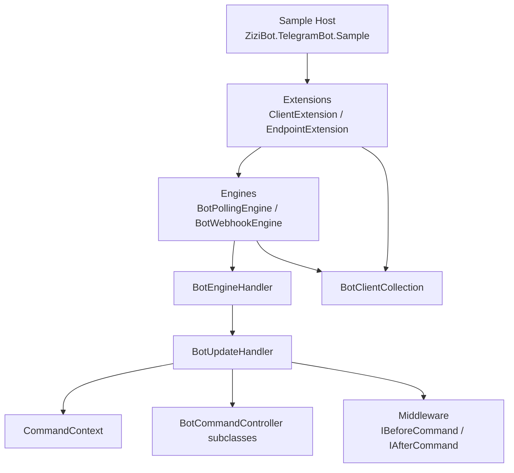

# Dependency Map

## External Dependencies

### Framework Project

Project: [ZiziBot.TelegramBot.Framework.csproj](../../ZiziBot.TelegramBot.Framework/ZiziBot.TelegramBot.Framework.csproj#L1-L32)

- Framework reference:
  - `Microsoft.AspNetCore.App` ([Framework.csproj](../../ZiziBot.TelegramBot.Framework/ZiziBot.TelegramBot.Framework.csproj#L21-L23))
- NuGet packages:
  - `WTelegramBot` — Telegram client API used by engines and request helpers
  - `Scrutor` — assembly scanning for middleware registration
  - `JetBrains.Annotations` — implicit use markers for discovery patterns
  - `UUIDNext` — generates sequential UUID session IDs in [CommandContext](../../ZiziBot.TelegramBot.Framework/Models/Context/CommandContext.cs#L114-L118)

### Sample Project

Project: [ZiziBot.TelegramBot.Sample.csproj](../../ZiziBot.TelegramBot.Sample/ZiziBot.TelegramBot.Sample.csproj#L1-L18)

- NuGet packages:
  - `Serilog.AspNetCore` — logging (configured in [Program.cs](../../ZiziBot.TelegramBot.Sample/Program.cs#L1-L19))
  - `Microsoft.AspNetCore.OpenApi` — swagger/OpenAPI tooling
- Project reference:
  - [ZiziBot.TelegramBot.Framework.csproj](../../ZiziBot.TelegramBot.Sample/ZiziBot.TelegramBot.Sample.csproj#L14-L16)

## Internal Dependencies (Framework)

The high-level layering is:

- Extensions compose the system (DI + endpoint mapping).
- Engines depend on handlers and the bot registry.
- Handlers depend on:
  - the command discovery cache
  - middleware interfaces
  - command models (context/controller)

## Update Routing Dependencies

`BotUpdateHandler` selects methods by reading attributes on controller methods:

- Commands: [CommandAttribute](../../ZiziBot.TelegramBot.Framework/Attributes/CommandAttribute.cs#L5-L10)
- Text commands: [TextCommandAttribute](../../ZiziBot.TelegramBot.Framework/Attributes/TextCommandAttribute.cs#L6-L12)
- Typed messages: [TypedCommandAttribute](../../ZiziBot.TelegramBot.Framework/Attributes/TypedCommandAttribute.cs#L6-L11)
- Default fallback: [DefaultCommandAttribute](../../ZiziBot.TelegramBot.Framework/Attributes/DefaultCommandAttribute.cs#L5-L8)
- Callback queries: [CallbackAttribute](../../ZiziBot.TelegramBot.Framework/Attributes/CallbackAttribute.cs#L5-L10)
- Inline queries: [InlineQueryAttribute](../../ZiziBot.TelegramBot.Framework/Attributes/InlineQueryAttribute.cs#L5-L10)
- Other updates: [UpdateCommandAttribute](../../ZiziBot.TelegramBot.Framework/Attributes/UpdateCommandAttribute.cs#L6-L11)
