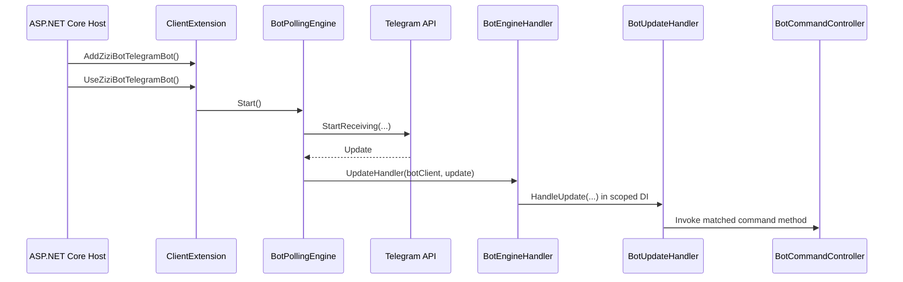
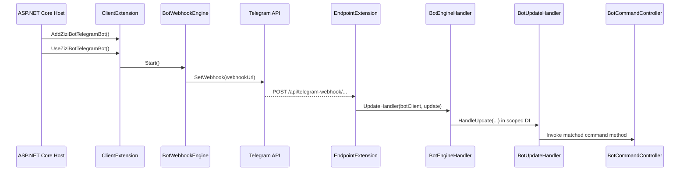

# Comprehensive Code Wiki

This page is a consolidated technical reference for the repository. It explains the solution structure, runtime architecture, major modules, key classes and methods, dependency relationships, configuration model, and how to run the project locally.

## Repository Overview

The repository contains two main projects:

- `ZiziBot.TelegramBot.Framework/`
  - A reusable command-based Telegram bot framework.
  - Provides engine selection, update routing, middleware execution, controller invocation, and helper abstractions for Telegram replies.
- `ZiziBot.TelegramBot.Sample/`
  - A minimal ASP.NET Core host that demonstrates how to wire up and run the framework.
  - Includes sample command controllers and middleware implementations.

Supporting documentation already exists in `docs/wiki/`, but this page is intended to be the single comprehensive reference.

## Solution Architecture

### High-Level Design

The framework is built as a layered pipeline:

1. The ASP.NET Core host registers the framework.
2. The framework binds configuration and selects the active engine.
3. The selected engine receives Telegram updates.
4. Each update is processed in a fresh dependency-injection scope.
5. The update is routed to a controller method using attributes.
6. Before/after middleware runs around the controller invocation.
7. The controller uses `CommandContext` helpers to respond through the Telegram Bot API.

### Main Entry Points

- Sample host startup: [`Program.cs`](../../ZiziBot.TelegramBot.Sample/Program.cs)
- Framework registration and engine startup: [`ClientExtension.cs`](../../ZiziBot.TelegramBot.Framework/Extensions/ClientExtension.cs)
- Update execution boundary: [`BotEngineHandler.cs`](../../ZiziBot.TelegramBot.Framework/Handlers/BotEngineHandler.cs)
- Update routing and invocation: [`BotUpdateHandler.cs`](../../ZiziBot.TelegramBot.Framework/Handlers/BotUpdateHandler.cs)
- Polling engine: [`BotPollingEngine.cs`](../../ZiziBot.TelegramBot.Framework/Engines/BotPollingEngine.cs)
- Webhook engine: [`BotWebhookEngine.cs`](../../ZiziBot.TelegramBot.Framework/Engines/BotWebhookEngine.cs)
- Webhook route mapping: [`EndpointExtension.cs`](../../ZiziBot.TelegramBot.Framework/Extensions/EndpointExtension.cs)

### Runtime Flow

#### Polling Mode



#### Webhook Mode



## Project Structure

### Framework Project

`ZiziBot.TelegramBot.Framework/` is organized by responsibility:

- `Attributes/`
  - Declarative metadata used for routing and middleware filtering.
- `Delegates/`
  - Delegate types used by middleware chaining.
- `Engines/`
  - Transport adapters that receive updates through polling or webhook registration.
- `Extensions/`
  - Framework registration, startup logic, background task helper, and webhook endpoint mapping.
- `Handlers/`
  - The core update execution pipeline.
- `Helpers/`
  - Shared reflection-based invocation helpers.
- `Interfaces/`
  - Contracts for engines and middleware.
- `Models/`
  - Runtime state, configuration models, controller base class, command context, enums, and constants.

### Sample Project

`ZiziBot.TelegramBot.Sample/` contains:

- `Program.cs`
  - Minimal ASP.NET Core host.
- `Commands/`
  - Example command controllers showing slash commands, text commands, callbacks, inline queries, and update-type handlers.
- `Middlewares/`
  - Example before/after middleware implementations.
- `appsettings*.json`
  - Local development configuration shape for bot engine options.
- `Properties/launchSettings.json`
  - Local URLs and environment profile settings for `dotnet run`.

## Responsibilities Of Major Modules

### Hosting And Composition

File: [`ClientExtension.cs`](../../ZiziBot.TelegramBot.Framework/Extensions/ClientExtension.cs)

Responsibilities:

- Discovers controller types by scanning all loaded assemblies for subclasses of `BotCommandController`.
- Builds a `BotCommandCollection` containing all discovered command types and methods.
- Registers all `IBeforeCommand` and `IAfterCommand` implementations using Scrutor.
- Binds `BotEngineConfig` and `BotTokenConfig` from configuration when config is not supplied programmatically.
- Resolves `EngineMode = Auto` into `ActualEngineMode`.
  - Development environment defaults to polling.
  - Non-development environment defaults to webhook.
- Registers the two engine implementations and exposes a single active `IBotEngine`.
- Registers core runtime services:
  - `BotEngineHandler`
  - `BotClientCollection`
  - `BotUpdateHandler`
  - `CommandContext`
- Starts the engine at application startup.
- Maps webhook routes only when webhook mode is active.

Important methods:

- `AddZiziBotTelegramBot()`
- `UseZiziBotTelegramBot()`
- `StartTelegramBot()`

### Engine Layer

Files:

- [`BotPollingEngine.cs`](../../ZiziBot.TelegramBot.Framework/Engines/BotPollingEngine.cs)
- [`BotWebhookEngine.cs`](../../ZiziBot.TelegramBot.Framework/Engines/BotWebhookEngine.cs)
- [`IBotEngine.cs`](../../ZiziBot.TelegramBot.Framework/Interfaces/IBotEngine.cs)

Responsibilities:

- Create `TelegramBotClient` instances from the configured bot token list.
- Register active clients into `BotClientCollection`.
- Translate transport-specific delivery into the shared update pipeline.
- Manage per-bot start and stop behavior.

`BotPollingEngine`:

- Deletes any previously registered webhook before starting.
- Calls `StartReceiving(...)` on each bot client.
- Uses `BotEngineHandler.UpdateHandler` as the shared callback for incoming updates.
- Supports stopping individual bots by cancelling their `CancellationTokenSource`.
- Implements `StopEngine()` to gracefully cancel all active polling cancellation tokens on host shutdown.

`BotWebhookEngine`:

- Deletes any previous webhook before registering the new one.
- Requires `BotEngineConfig.WebhookUrl`.
- Builds the final webhook path from:
  - `ValueConst.WebHookPath`
  - optional `WebhookKey`
  - either bot token or bot name, based on `UseBotTokenInWebhookPath`
- Calls `SetWebhook(...)` for each configured bot.
- Stops bots by deleting their webhook registrations.
- Implements `StopEngine()` to delete registered webhooks from Telegram API on host shutdown.

### Webhook Endpoint Layer

File: [`EndpointExtension.cs`](../../ZiziBot.TelegramBot.Framework/Extensions/EndpointExtension.cs)

Responsibilities:

- Maps webhook routes under `api/telegram-webhook`.
- Resolves the target bot from the route parameter.
- Accepts either bot token or bot name as the route identifier.
- Validates the webhook key when configured.
- Deserializes `Telegram.Bot.Types.Update` from the incoming POST body.
- Forwards the update to `BotEngineHandler.UpdateHandler`.

Supported route shapes:

- Without webhook key:
  - `POST /api/telegram-webhook/{bot}`
  - `GET /api/telegram-webhook/{bot}` for a simple diagnostic response
- With webhook key:
  - `POST /api/telegram-webhook/{webhookKey}/{bot}`

### Update Execution Boundary

File: [`BotEngineHandler.cs`](../../ZiziBot.TelegramBot.Framework/Handlers/BotEngineHandler.cs)

Responsibilities:

- Creates a new async dependency-injection scope per update.
- Resolves the scoped `BotUpdateHandler`.
- Applies the execution policy defined by `BotEngineConfig.ExecutionMode`:
  - `Await`: process the update inline
  - `Background`: fire-and-forget with exception logging through `TaskExtension.FireAndForget`

Important methods:

- `UpdateHandler(...)`
- `UpdateHandlerInternal(...)`

### Routing And Invocation Core

File: [`BotUpdateHandler.cs`](../../ZiziBot.TelegramBot.Framework/Handlers/BotUpdateHandler.cs)

This is the core of the framework.

Responsibilities:

- Receives an update and stores the per-request state in `CommandContext`.
- Distinguishes between message-like updates and non-message updates.
- Selects a controller method based on routing attributes.
- Creates the controller instance with `ActivatorUtilities`.
- Injects `CommandContext` into the controller and method parameters.
- Runs before middleware.
- Invokes the matched controller method.
- Runs after middleware.
- Tracks queue/backlog diagnostics differently for polling and webhook mode.

Key internal responsibilities:

- Message routing
  - `[Command]`
  - `[TextCommand]`
  - `[TypedCommand]`
  - `[DefaultCommand]`
- Non-message routing
  - `[Callback]`
  - `[InlineQuery]`
  - `[UpdateCommand]`
- Middleware filtering
  - disabled by attribute
  - disabled by config
  - filtered by update type

Important methods:

- `HandleUpdate(...)`
- `OnMessage(...)`
- `OnUpdate(...)`
- `InvokeMethod(...)`
- `InvokeCommand(...)`
- `ExecuteBeforeMiddlewareAsync(...)`
- `ExecuteAfterMiddlewareAsync(...)`
- `GetMethod(Message)`
- `GetMethod(CallbackQuery)`
- `GetMethod(InlineQuery)`
- `GetMethod(Update)`

## Routing Model

The framework uses attributes placed on public controller methods.

### Command Attributes

Files:

- [`CommandAttribute.cs`](../../ZiziBot.TelegramBot.Framework/Attributes/CommandAttribute.cs)
- [`TextCommandAttribute.cs`](../../ZiziBot.TelegramBot.Framework/Attributes/TextCommandAttribute.cs)
- [`TypedCommandAttribute.cs`](../../ZiziBot.TelegramBot.Framework/Attributes/TypedCommandAttribute.cs)
- [`DefaultCommandAttribute.cs`](../../ZiziBot.TelegramBot.Framework/Attributes/DefaultCommandAttribute.cs)
- [`CallbackAttribute.cs`](../../ZiziBot.TelegramBot.Framework/Attributes/CallbackAttribute.cs)
- [`InlineQueryAttribute.cs`](../../ZiziBot.TelegramBot.Framework/Attributes/InlineQueryAttribute.cs)
- [`UpdateCommandAttribute.cs`](../../ZiziBot.TelegramBot.Framework/Attributes/UpdateCommandAttribute.cs)

Behavior:

- `[Command("start")]`
  - Matches slash-command style input such as `/start`.
  - Supports `/command@botname` and stores the trailing text in `BotCommandInfo.Params`.
- `[TextCommand("ping")]`
  - Matches message text according to `ComparisonMode`.
  - The current router implementation actively uses `Match`, `Contains`, and `CommandLike`.
- `[TypedCommand(MessageType.NewChatMembers)]`
  - Matches message subtype values from Telegram.
- `[DefaultCommand]`
  - Fallback for unmatched message-based input.
- `[Callback("ping")]`
  - Matches callback query data by its first token.
- `[Callback]`
  - Fallback callback handler when no specific callback command matches.
- `[InlineQuery("hello")]`
  - Matches inline query by its first token.
- `[InlineQuery]`
  - Fallback inline query handler.
- `[UpdateCommand(UpdateType.ChatJoinRequest)]`
  - Handles update types that are not regular messages.

### Comparison Modes

File: [`ComparisonMode.cs`](../../ZiziBot.TelegramBot.Framework/Models/Enums/ComparisonMode.cs)

Declared modes:

- `Match`
- `CommandLike`
- `StartWith`
- `FirstWord`
- `Contains`
- `Pattern`
- `Regex`
- `Any`

Current implementation note:

- The enum defines more options than the router currently implements. The routing logic currently uses a subset of these values, so new comparison modes should be verified against `BotUpdateHandler` before relying on them.

## Middleware Model

Files:

- [`IBeforeCommand.cs`](../../ZiziBot.TelegramBot.Framework/Interfaces/IBeforeCommand.cs)
- [`IAfterCommand.cs`](../../ZiziBot.TelegramBot.Framework/Interfaces/IAfterCommand.cs)
- [`IMiddlewareConfig.cs`](../../ZiziBot.TelegramBot.Framework/Interfaces/IMiddlewareConfig.cs)
- [`MiddlewareFilterAttribute.cs`](../../ZiziBot.TelegramBot.Framework/Attributes/MiddlewareFilterAttribute.cs)
- [`DisabledMiddlewareAttribute.cs`](../../ZiziBot.TelegramBot.Framework/Attributes/DisabledMiddlewareAttribute.cs)

Responsibilities:

- `IBeforeCommand`
  - Runs before controller invocation.
  - Receives `CommandContext` and a `next` delegate.
  - Must call `next(...)` for the pipeline to continue.
- `IAfterCommand`
  - Runs after controller invocation.
- `IMiddlewareConfig`
  - Allows middleware to receive the active `BotEngineConfig`.

Filtering mechanisms:

- Class-level `[DisabledMiddleware]`
  - Permanently disables a middleware type.
- `BotEngineConfig.DisabledMiddleware`
  - Disables middleware by class name through configuration.
- `[MiddlewareFilter(UpdateType.X)]`
  - Restricts a middleware to specific Telegram update types.

Sample implementations:

- [`BeforeCommandMiddleware.cs`](../../ZiziBot.TelegramBot.Sample/Middlewares/BeforeCommandMiddleware.cs)
- [`AfterCommandMiddleware.cs`](../../ZiziBot.TelegramBot.Sample/Middlewares/AfterCommandMiddleware.cs)
- [`UserPreparationMiddleware.cs`](../../ZiziBot.TelegramBot.Sample/Middlewares/UserPreparationMiddleware.cs)

## Core Runtime Models

### `BotCommandController`

File: [`BotCommandController.cs`](../../ZiziBot.TelegramBot.Framework/Models/BotCommandController.cs)

Purpose:

- Base class for user-defined command controllers.
- Exposes `Context` for the active request.
- Provides helper methods for common Telegram actions:
  - `SendMessage(...)`
  - `AnswerCallbackQuery(...)`
  - `AnswerInlineQuery(...)`
- Exposes optional initialization hooks:
  - `Initialize(long telegramId)`
  - `InitializeAsync(long telegramId)`

### `CommandContext`

Files:

- [`CommandContext.cs`](../../ZiziBot.TelegramBot.Framework/Models/Context/CommandContext.cs)
- [`CommandContext.Request.cs`](../../ZiziBot.TelegramBot.Framework/Models/Context/CommandContext.Request.cs)
- [`CommandContext.Mutate.cs`](../../ZiziBot.TelegramBot.Framework/Models/Context/CommandContext.Mutate.cs)

Purpose:

- Represents the normalized per-update runtime context.
- Stores the active bot token, bot client, update object, and engine configuration.
- Exposes convenience properties for:
  - chat
  - user
  - message
  - callback query
  - inline query
  - forum topics
  - timestamps and session id
- Exposes helper methods for Telegram API responses:
  - `SendMessage(...)`
  - `AnswerInlineQuery(...)`
  - `AnswerCallbackQuery(...)`

Important behavior:

- `ReplyMode.ReplyToSender` causes `SendMessage(...)` to default the reply target to the current message id.
- `SetContext(...)` copies scoped state from the current handler into controller-visible context.

### `BotClientCollection`

File: [`BotClientCollection.cs`](../../ZiziBot.TelegramBot.Framework/Models/BotClientCollection.cs)

Purpose:

- Shared registry of active bot clients.
- Uses an internal lock for thread-safe mutation and lookup.
- Supports access by:
  - bot name
  - bot token
  - client instance

Important methods:

- `TryAdd(...)`
- `TryRemoveByName(...)`
- `TryGetByName(...)`
- `TryGetByToken(...)`
- `TryGetByClient(...)`
- `GetNamesSnapshot()`

### `BotClientItem`

File: [`BotClientItem.cs`](../../ZiziBot.TelegramBot.Framework/Models/BotClientItem.cs)

Purpose:

- Represents one configured bot runtime instance.
- Stores:
  - display name
  - bot token
  - `ITelegramBotClient`
  - `CancellationTokenSource`

Factory method:

- `Create(...)`
  - Creates the client object and default cancellation token source.

### `BotCommandCollection`

File: [`BotCommandCollection.cs`](../../ZiziBot.TelegramBot.Framework/Models/BotCommandCollection.cs)

Purpose:

- Stores all discovered command controller types and the methods extracted from them.
- Acts as the routing source used by `BotUpdateHandler`.

### `BotCommandInfo`

File: [`BotCommandInfo.cs`](../../ZiziBot.TelegramBot.Framework/Models/BotCommandInfo.cs)

Purpose:

- Bundles the selected controller type, method, and update-specific metadata needed for invocation.
- Carries command parameters extracted from message text.

## Key Supporting Helpers

### `MethodHelper`

File: [`MethodHelper.cs`](../../ZiziBot.TelegramBot.Framework/Helpers/MethodHelper.cs)

Purpose:

- Invokes controller methods through reflection.
- Supports both synchronous methods and async methods returning `Task`.

Important note:

- The helper checks async state-machine metadata and handles `Task` methods safely, which lets controller methods be authored with normal async signatures.

### `TaskExtension`

File: [`TaskExtension.cs`](../../ZiziBot.TelegramBot.Framework/Extensions/TaskExtension.cs)

Purpose:

- Provides `FireAndForget(...)` for best-effort background execution.
- Logs unobserved exceptions from faulted background tasks.

## Dependency Relationships

### Internal Layering

The dependency direction is intentionally simple:

```text
Sample Host
  -> Framework Extensions
  -> Engine Implementations
  -> Update Handlers
  -> Controllers + Context + Middleware
  -> Telegram.Bot client API
```

More concretely:

- `ZiziBot.TelegramBot.Sample`
  - depends on `ZiziBot.TelegramBot.Framework`
- `ClientExtension`
  - depends on configuration, hosting environment, logging, engine implementations, handler services, and model types
- `BotPollingEngine` and `BotWebhookEngine`
  - depend on `BotEngineHandler`, `BotClientCollection`, and token/config models
- `BotEngineHandler`
  - depends on `IServiceProvider`, `BotEngineConfig`, and scoped `BotUpdateHandler`
- `BotUpdateHandler`
  - depends on:
    - `BotCommandCollection`
    - `BotClientCollection`
    - `CommandContext`
    - configured middleware services
    - reflection helper methods
- Controllers
  - depend on `CommandContext` and Telegram helper methods

### External Dependencies

Framework packages from [`ZiziBot.TelegramBot.Framework.csproj`](../../ZiziBot.TelegramBot.Framework/ZiziBot.TelegramBot.Framework.csproj):

- `WTelegramBot`
  - Telegram client library used to send and receive updates.
- `Scrutor`
  - Assembly scanning for middleware registration.
- `UUIDNext`
  - Sequential UUID generation for `CommandContext.SessionId`.
- `JetBrains.Annotations`
  - Code annotations for discovery/usage hints.
- `Microsoft.AspNetCore.App`
  - Hosting and endpoint support.

Sample host packages from [`ZiziBot.TelegramBot.Sample.csproj`](../../ZiziBot.TelegramBot.Sample/ZiziBot.TelegramBot.Sample.csproj):

- `Serilog.AspNetCore`
  - Console logging setup in the sample host.
- `Microsoft.AspNetCore.OpenApi`
  - Included in the sample project, though the current `Program.cs` stays minimal.

## Configuration Model

### `BotEngineConfig`

File: [`BotEngineConfig.cs`](../../ZiziBot.TelegramBot.Framework/Models/Configs/BotEngineConfig.cs)

Configuration section: `BotEngine`

Fields:

- `WebhookUrl`
  - Base public URL used for webhook registration.
- `WebhookKey`
  - Optional extra path segment used to protect the webhook route.
- `UseBotTokenInWebhookPath`
  - Controls whether the webhook path uses the bot token or bot name.
- `EngineMode`
  - Requested mode: `Auto`, `Polling`, or `Webhook`.
- `ActualEngineMode`
  - Resolved runtime mode after environment-based fallback.
- `ReplyMode`
  - Reply behavior for `CommandContext.SendMessage(...)`.
- `ExecutionMode`
  - `Await` or `Background`.
- `DisabledMiddleware`
  - Optional list of middleware class names to skip.
- `Bot`
  - List of bot token definitions.

### `BotTokenConfig`

File: [`BotTokenConfig.cs`](../../ZiziBot.TelegramBot.Framework/Models/Configs/BotTokenConfig.cs)

Configuration section: `BotEngine:Bot`

Fields:

- `Name`
  - Logical bot identifier used in the runtime registry and, optionally, in webhook paths.
- `Token`
  - Telegram bot token.

### Development Sample Configuration

File: [`appsettings.Development.json`](../../ZiziBot.TelegramBot.Sample/appsettings.Development.json)

The sample configuration demonstrates:

- webhook URL and key fields
- `EngineMode = Auto`
- `ReplyMode = ReplyToSender`
- `ExecutionMode = Background`
- middleware disabling by class name
- multiple bot entries under `BotEngine:Bot`

Security note:

- The sample development file currently shows token-shaped values. Real bot tokens should never be committed. Prefer environment variables or local secret storage for actual credentials.

## Sample Project Usage Examples

### Command Controller Examples

File: [`SampleCommands.cs`](../../ZiziBot.TelegramBot.Sample/Commands/SampleCommands.cs)

Demonstrates:

- slash command routing with `[Command("ping")]`, `[Command("start")]`, and `[Command("say")]`
- text routing with `[TextCommand("ping")]`
- default fallback routing with `[DefaultCommand]`
- callback routing with `[Callback("ping")]` and `[Callback]`
- sending messages and callback answers through inherited helper methods

File: [`InlineQueryCommands.cs`](../../ZiziBot.TelegramBot.Sample/Commands/InlineQueryCommands.cs)

Demonstrates:

- default inline query handling with `[InlineQuery]`
- command-like inline query routing with `[InlineQuery("hello")]` and `[InlineQuery("id")]`
- inline query result generation

File: [`EventCommands.cs`](../../ZiziBot.TelegramBot.Sample/Commands/EventCommands.cs)

Demonstrates:

- message-type routing with `[TypedCommand(MessageType.NewChatMembers)]`
- non-message update routing with `[UpdateCommand(UpdateType.ChatJoinRequest)]`

## How To Run The Project

### Prerequisites

- .NET SDK that can build the target frameworks used by the solution
- at least one Telegram bot token
- a public URL if you want to test webhook mode

### Local Development Flow

1. Open the repository root.
2. Configure bot settings.
3. Build the solution.
4. Run the sample host.
5. Send Telegram updates to the configured bot.

### Build

```powershell
dotnet build
```

### Run The Sample Host

```powershell
dotnet run --project .\ZiziBot.TelegramBot.Sample
```

Default local URLs are defined in [`launchSettings.json`](../../ZiziBot.TelegramBot.Sample/Properties/launchSettings.json):

- `http://localhost:5157`
- `https://localhost:7137`

### Minimal Configuration

At minimum, define one bot under `BotEngine:Bot`.

Example shape:

```json
{
  "BotEngine": {
    "EngineMode": "Polling",
    "Bot": [
      {
        "Name": "Main",
        "Token": "__YOUR_BOT_TOKEN__"
      }
    ]
  }
}
```

### Choosing Polling vs Webhook

- Use polling for local development or when you do not have a public inbound URL.
- Use webhook when deploying publicly and you want Telegram to push updates to the application.

`EngineMode = Auto` resolves to:

- `Polling` in development
- `Webhook` outside development

### Webhook Requirements

To use webhook mode, configure:

- `BotEngine:WebhookUrl`
- optionally `BotEngine:WebhookKey`
- at least one `BotEngine:Bot` entry

The framework will register webhook URLs using:

- `api/telegram-webhook/{bot}` when no key is configured
- `api/telegram-webhook/{webhookKey}/{bot}` when a key is configured

The `bot` segment is either:

- the bot token, when `UseBotTokenInWebhookPath = true`
- the bot name, when `UseBotTokenInWebhookPath = false`

## Extension Points For Contributors

### Adding A New Command

1. Create a class that inherits from `BotCommandController`.
2. Add public methods decorated with routing attributes.
3. Optionally inject `CommandContext` through the constructor.
4. Use `SendMessage(...)`, `AnswerCallbackQuery(...)`, or `AnswerInlineQuery(...)` to respond.

### Adding Middleware

1. Implement `IBeforeCommand` or `IAfterCommand`.
2. Optionally add `[MiddlewareFilter(...)]` to restrict the middleware.
3. Optionally implement `IMiddlewareConfig` to access the active engine configuration.
4. Ensure before middleware calls `next(...)` if execution should continue.

### Hosting The Framework In Another App

1. Reference `ZiziBot.TelegramBot.Framework`.
2. Call `builder.Services.AddZiziBotTelegramBot();`
3. Call `await app.UseZiziBotTelegramBot();`
4. Provide `BotEngine` configuration through app settings or code.

## Summary

This repository is organized around a clear separation of concerns:

- the sample host bootstraps ASP.NET Core
- `ClientExtension` composes the framework
- engines receive updates
- `BotEngineHandler` creates a per-update scope
- `BotUpdateHandler` routes and executes commands
- controllers and middleware implement bot behavior
- `CommandContext` provides the ergonomic API surface for responding to Telegram events

For detailed topic-by-topic references, see the rest of the pages in `docs/wiki/`.
